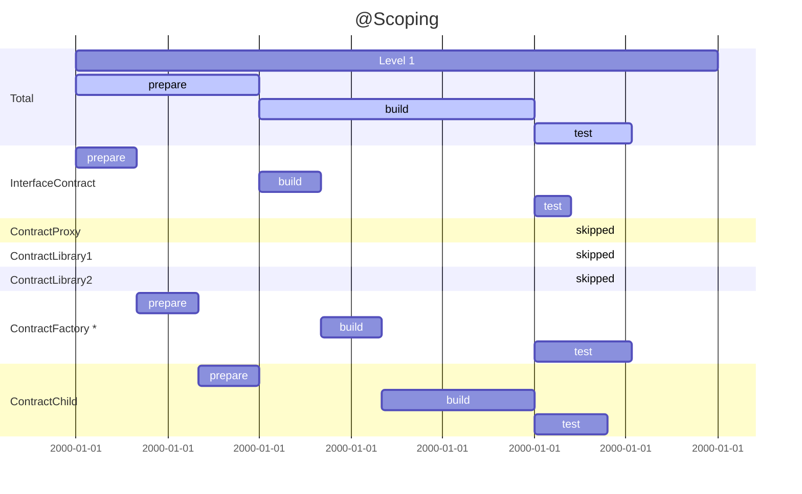

# forge-scope

## Overview

- scoping
- format
    - lockfile
    - deployments
- ref. impl.

## Motivation

## Scoping

One of the first way to speeding up build jobs is to use "scoping". 
Usually a change only affect a subset of the graph. 
We can get rid of the builds of `ContractProxy`, `ContractLibrary1` and `ContractLibrary2` if the only changes 
are inside `ContractFactory`. However, we'll note that `ContractChild` is still affected, resulting in this.

Yarn workspaces can share modules across child projects/packages by hoisting them up to their parent project’s node_modules: `monorepo/node_modules`. This optimization becomes even more prominent when considering these packages will most likely be dependent on each other (the main reason to have the monorepo), i.e. higher degree of redundancy.

