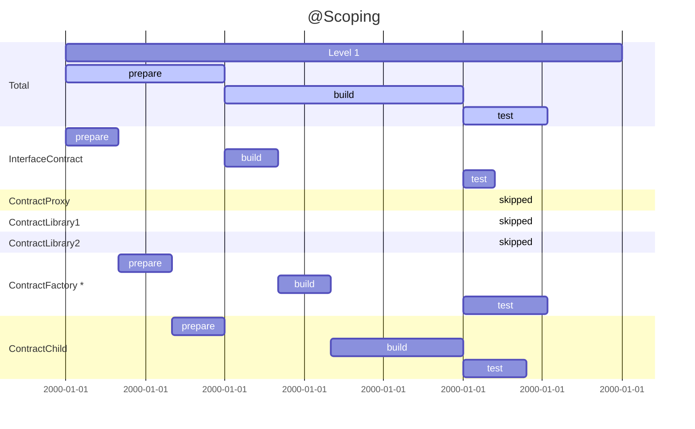

# forge-scope

> ~/.foundryrc or $XDG_CONFIG_HOME/foundry/foundryrc or ~/.config/foundry/foundryrc


## Overview


### Current

```sh
ds-test/=lib/ds-test/src/
@openzeppelin/=node_modules/@openzeppelin/
@rari-capital/=node_modules/@rari-capital/
@manifoldxyz/=node_modules/@manifoldxyz/
```

### Proposed

```json
{
	"imports": {
		"@openzeppelin/contracts/": "/node_modules/@openzeppelin/contracts/",
		"@uniswap/v2-core/": "/node_modules/@uniswap/v2-core/",
		"@uniswap/v3-periphery/": "/node_modules/@uniswap/v3-periphery/"
	},
	"scopes": {}
}
```

[TOC]
- scoping
- format
    - lockfile
    - deployments
- ref. impl.

## Motivation

t.b.d

## Scoping

One of the first way to speeding up build jobs is to use "scoping". 
Usually a change only affect a subset of the graph. 
We can get rid of the builds of `ContractProxy`, `ContractLibrary1` and `ContractLibrary2` if the only changes 
are inside `ContractFactory`. However, we'll note that `ContractChild` is still affected, resulting in this.




## Monorepos


Yarn workspaces can share modules across child projects/packages by hoisting them up to their parent project’s node_modules: `monorepo/node_modules`. This optimization becomes even more prominent when considering these packages will most likely be dependent on each other (the main reason to have the monorepo), i.e. higher degree of redundancy.


## Import Maps


> Note to use with esm / URL based imports

```shell=
 ?pin=BUILD_VERSON
```

### Import Maps 

https://github.com/WICG/import-maps

```jsonc 
  "dependencies": {
    "@openzeppelin/contracts": "^4.5.0",
    "@uniswap/v2-core": "^1.0.1",
    "@uniswap/v3-periphery": "^1.4.0"
  }
}
```
## Generate the import mappings 

```sh 
$ npx importly < package.json > forge-importmap.json
$ cat forge-importmap.json
```

```jsonc 
{

"imports": {
	"@openzeppelin/contracts/": "/node_modules/@openzeppelin/contracts/",
	"@uniswap/v2-core/": "/node_modules/@uniswap/v2-core/",
	"@uniswap/v3-periphery/": "/node_modules/@uniswap/v3-periphery/"
	},
"scopes": {}
}
```

## File based Imports

```json 
  "files": [
    "contracts/base",
    "contracts/interfaces",
    "contracts/libraries",
    "artifacts/contracts/**/*.json",
    "!artifacts/contracts/**/*.dbg.json",
    "!artifacts/contracts/test/**/*",
    "!artifacts/contracts/base/**/*"
  ],

```


## Fetching Imports via Git 

```	ts
/**
* @note Fetch Imports via Git+HTTPS
*/

interface CommitIshInfoMatchResult {
  user: string;
  repo: string;
  subdirs?: string[];
}
const matchCommitIshInfo = match<CommitIshInfoMatchResult>(
  ":user/:repo/:subdirs*(/)?",
);
const matchFromUrl = match<MatchResult>(
  "/:url((?:[^?]+/)+[^?]+){\\?:commit([^?&=]+)}?(.+)?",
);
```
